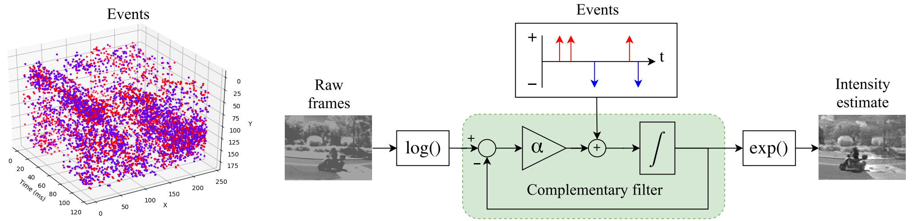
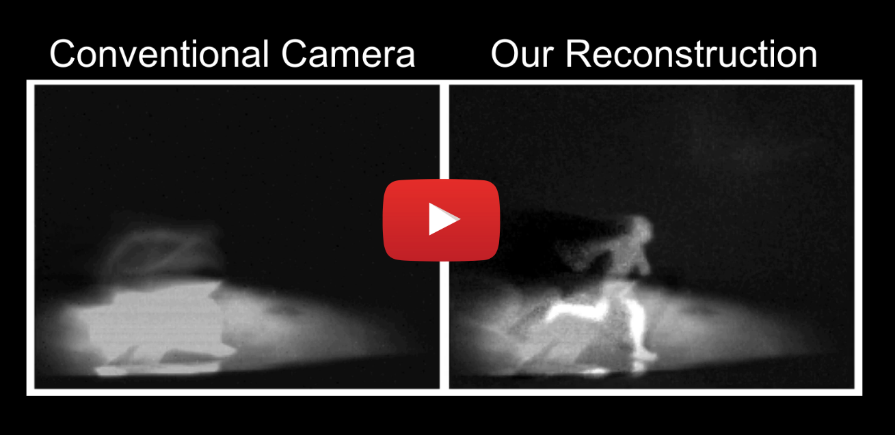

# Event Camera Demo
**By Cedric Scheerlinck**

Load and visualize events in a jupyter notebook.  
Inspired by [https://github.com/cedric-scheerlinck/dvs_image_reconstruction](https://github.com/cedric-scheerlinck/dvs_image_reconstruction).



## Installation
Install required packages:
```pip install -r requirements.txt```

Enable ipywidgets:
```jupyter nbextension enable --py widgetsnbextension```

## Run
```jupyter notebook main.ipynb```

## Video
[](https://youtu.be/bZ0ZKido0Ag)
[https://youtu.be/bZ0ZKido0Ag](https://youtu.be/bZ0ZKido0Ag)

### Reference
* Cedric Scheerlinck, Nick Barnes, Robert Mahony, "Continuous-time Intensity Estimation Using Event Cameras", Asian Conference on Computer Vision (ACCV), Perth, 2018.  
[PDF](https://cedric-scheerlinck.github.io/files/2018_scheerlinck_continuous-time_intensity_estimation.pdf), [Website](https://cedric-scheerlinck.github.io/continuous-time-intensity-estimation), [BibTex](https://cedric-scheerlinck.github.io/files/2018_accv_continuous_bibtex.txt).
